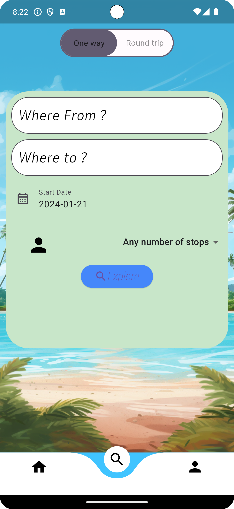

# Flight Savvy App

Welcome to the Flight Savvy app repository! This Flutter-based application provides a user-friendly interface for tracking and managing flights. Follow the steps below to navigate to the `flight_savvy` folder and run the app on your local machine.

## Prerequisites
Make sure you have the following installed on your system:
- [Flutter](https://flutter.dev/docs/get-started/install)
- [Git](https://git-scm.com/book/en/v2/Getting-Started-Installing-Git)

## Clone the Repository
```bash
git clone https://github.com/your-username/flight-savvy.git
```

## Navigate to the flight_savvy Folder
```bash
cd flight-savvy/flight_savvy
```

## Install Dependencies
```bash
flutter pub get
```

## Install Dependencies
```bash
flutter pub get
```

## Run the App
```bash
flutter run
```

This will launch the Flight Savvy app on the default emulator or connected device.

If you encounter any issues during the installation or running process, please refer to the Flutter documentation or check the repository's issue tracker for solutions.

The app has been extensively tested to work with Pixel 7 Pro API 34.

Happy flying with Flight Savvy! ✈️📱

Some screenshots of the app:





